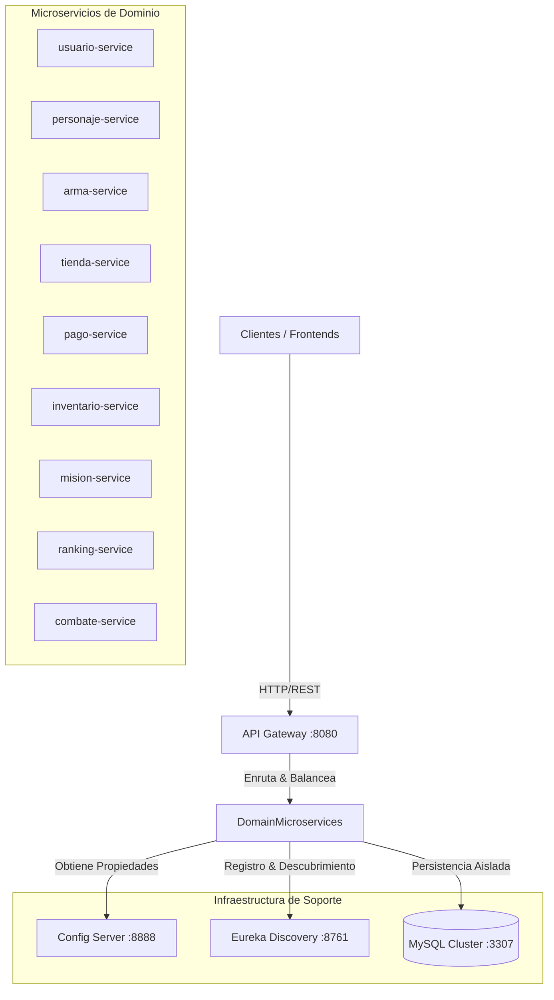
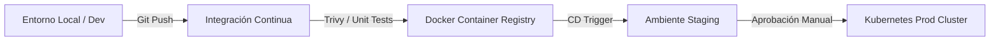

# VideoJuegoOnline — Plataforma Distribuidora de Microservicios Backend

[](https://openjdk.org/)
[](https://spring.io/projects/spring-boot)
[](https://www.docker.com/)
[](#arquitectura)
[](#licencia)

---

## 2. Resumen Ejecutivo

**VideoJuegoOnline** es una plataforma backend de grado empresarial diseñada bajo un enfoque de microservicios distribuidos para dar soporte a un ecosistema de videojuegos en línea (MMORPG/multijugador masivo). El sistema expone servicios desacoplados para la gestión del ciclo de vida del usuario, progresión de personajes, combate en tiempo real, inventarios compartidos, compras internas, ranking global y mecánicas de misiones. 

La arquitectura prioriza la **alta disponibilidad**, el **aislamiento de datos por dominio**, la **seguridad perimetral** y el **despliegue local y en la nube 100% reproducible** mediante contenedores Docker y orquestación estructurada.

---

## 3. Objetivos del Sistema

*   **Desacoplamiento Operacional:** Aislar los dominios críticos (e.g., pagos y combate) para mitigar fallas en cascada.
*   **Aislamiento Estricto de Persistencia:** Cada microservicio gestiona su propia base de datos relacional independiente bajo el principio de *Database-per-Service*.
*   **Despliegue Homogéneo:** Garantizar que los entornos locales de desarrollo, preproducción y producción se comporten de manera idéntica mediante empaquetado inmutable.
*   **Seguridad por Diseño (Secure by Design):** Minimizar la superficie de ataque de los contenedores utilizando imágenes base reducidas, privilegios no root y comunicación controlada por pasarela de API.
*   **Observabilidad Centralizada:** Facilitar el diagnóstico rápido del estado de salud y métricas de desempeño de todos los servicios.

---

## 4. Arquitectura

La solución implementa un patrón de microservicios con soporte de **Spring Cloud** para el descubrimiento, la configuración y el enrutamiento:



### Componentes Clave:
1.  **API Gateway (`:8080`):** Punto único de entrada. Realiza enrutamiento dinámico, agregación de endpoints y control de accesos.
2.  **Eureka Server (`:8761`):** Servidor de descubrimiento de servicios (Service Registry) que mantiene el mapa dinámico de instancias activas.
3.  **Config Server (`:8888`):** Proveedor centralizado de propiedades dinámicas y variables de entorno externas, soportando perfiles locales e imágenes Docker.
4.  **Servicios de Dominio:** Microservicios independientes construidos sobre Spring Boot 3 y Java 21, comunicándose internamente de forma asíncrona o vía HTTP REST orientada por Eureka.

---

## 5. Requisitos Previos

Antes de compilar y desplegar la plataforma, asegúrese de contar con las siguientes herramientas instaladas y configuradas:

*   **Java Development Kit (JDK):** Versión 21 LTS (se recomienda Eclipse Temurin).
*   **Apache Maven:** Versión 3.9.x (o uso directo de los scripts autoinstalables `mvnw`).
*   **Docker Engine:** Versión 24.0.0 o superior.
*   **Docker Compose:** Versión v2.20.0 o superior (compatible con especificación V3.8+).
*   **Git:** Para clonación y control de versiones.

---

## 6. Estructura del Repositorio

La disposición de los módulos del proyecto sigue un esquema monorrepo con la siguiente jerarquía:

```text
VideoJuegoOnline/
├── .github/                     # Pipelines de CI/CD (GitHub Actions)
├── config-server/               # Spring Cloud Config Server y propiedades centralizadas
│   ├── config-microservicios/   # Archivos YAML de configuración externa
│   └── Dockerfile
├── eureka-server/               # Spring Cloud Eureka Discovery Server
│   └── Dockerfile
├── api-gateway/                 # Gateway de enrutamiento perimetral
│   └── Dockerfile
├── [microservicio]-service/     # Directorios correspondientes a los servicios de dominio
│   ├── src/                     # Código fuente Java del microservicio
│   ├── pom.xml                  # Descriptor de dependencias Maven
│   └── Dockerfile               # Compilación multi-stage optimizada
├── init-db/                     # Scripts SQL de inicialización para contenedores
│   └── init.sql
├── docker-compose.yml           # Declaración y orquestación local de servicios
└── README.md                    # Documentación principal del sistema
```

---

## 7. Compilación y Ejecución

### 7.1. Ejecución Local (Entorno de Desarrollo)

Para ejecutar cualquier servicio de manera local aislada apuntando a bases de datos locales:

1. Compile el módulo correspondiente:
   ```bash
   cd usuario-service
   ./mvnw clean package -DskipTests
   ```
2. Ejecute el artefacto `.jar` especificando el perfil de desarrollo:
   ```bash
   java -jar target/usuario-service-0.0.1-SNAPSHOT.jar --spring.profiles.active=dev
   ```

### 7.2. Construcción de Imágenes Docker por Módulo

Para construir manualmente la imagen Docker de un servicio individual empleando la optimización Multi-Stage:

```bash
docker build -t cl.videojuego/usuario-service:1.0.0 ./usuario-service
```

### 7.3. Despliegue Completo con Docker Compose

La forma recomendada para inicializar toda la topología de la plataforma es utilizar el archivo orquestador principal:

1. **Compilar y levantar toda la pila en background:**
   ```bash
   docker compose up -d --build
   ```
2. **Verificar el estado operacional de los contenedores:**
   ```bash
   docker compose ps
   ```
3. **Detener y limpiar los recursos de red locales:**
   ```bash
   docker compose down
   ```

> [!NOTE]
> La directiva `depends_on` con la condición `service_healthy` garantiza que los microservicios arranquen en la secuencia correcta: primero la base de datos `mysql`, luego el `config-server`, seguido de `eureka-server` y `api-gateway`, y finalmente los servicios de negocio.

---

## 8. Configuración y Variables de Entorno

El sistema se apoya en perfiles de Spring (`dev`, `docker`, `native`) para desacoplar el entorno físico de la lógica de negocio.

### 8.1. Perfiles de Configuración
*   **`dev` / `default`:** Utilizado para arranques nativos en la máquina del desarrollador (`localhost`).
*   **`docker`:** Configuración inyectada de manera predeterminada en los contenedores. Utiliza DNS de Docker para apuntar a servicios (`http://eureka-server:8761`).

### 8.2. Variables de Entorno Requeridas

| Variable de Entorno | Valor por Defecto | Descripción |
| :--- | :--- | :--- |
| `SPRING_PROFILES_ACTIVE` | `default` | Define las propiedades activas de configuración de Spring. |
| `CONFIG_SERVER_URL` | `http://localhost:8888` | Endpoint base para obtener la configuración centralizada. |
| `MYSQL_ROOT_PASSWORD` | `root` | Contraseña administrativa del motor de base de datos de desarrollo. |
| `MYSQL_USER` | `videojuego` | Usuario principal de base de datos con permisos sobre los esquemas. |
| `MYSQL_PASSWORD` | `videojuego` | Contraseña del usuario principal. |
| `DB_NAME` | *(Varía por servicio)* | Nombre de la base de datos a la que se conectará el microservicio. |

---

## 9. Catálogo de Servicios y Endpoints

A través del **API Gateway (`:8080`)** se puede acceder de forma centralizada a los endpoints expuestos por los microservicios de dominio:

| Microservicio | Puerto Interno | Prefijo en Gateway (`/api/v1/...`) | Endpoint de Salud (Health Check) |
| :--- | :---: | :--- | :--- |
| **API Gateway** | `8080` | `/` | `http://localhost:8080/actuator/health` |
| **Config Server** | `8888` | *N/A* | `http://localhost:8888/actuator/health` |
| **Eureka Server** | `8761` | *N/A* | `http://localhost:8761/actuator/health` |
| **usuario-service** | Dynamic | `/usuarios/**` | `http://localhost:8080/api/v1/usuarios/actuator/health` |
| **personaje-service**| Dynamic | `/personajes/**` | `http://localhost:8080/api/v1/personajes/actuator/health` |
| **arma-service** | Dynamic | `/armas/**` | `http://localhost:8080/api/v1/armas/actuator/health` |
| **tienda-service** | Dynamic | `/tiendas/**` | `http://localhost:8080/api/v1/tiendas/actuator/health` |
| **pago-service** | Dynamic | `/pagos/**` | `http://localhost:8080/api/v1/pagos/actuator/health` |
| **inventario-service**| Dynamic | `/inventarios/**` | `http://localhost:8080/api/v1/inventarios/actuator/health` |
| **mision-service** | Dynamic | `/misiones/**` | `http://localhost:8080/api/v1/misiones/actuator/health` |
| **ranking-service** | Dynamic | `/rankings/**` | `http://localhost:8080/api/v1/rankings/actuator/health` |
| **combate-service** | Dynamic | `/combates/**` | `http://localhost:8080/api/v1/combates/actuator/health` |

---

## 10. Seguridad y Hardening en Contenedores

Para cumplir con estándares modernos de ciberseguridad en entornos de producción (similares a lineamientos de CIS Benchmarks), las imágenes de contenedor de este repositorio aplican estrictas medidas de mitigación:

### 10.1. Estrategia Multi-Stage en Dockerfile
Separamos el entorno de compilación (JDK completo) de la imagen de tiempo de ejecución (JRE mínimo libre de compiladores y herramientas innecesarias), reduciendo drásticamente la superficie de ataque explotable.

```dockerfile
# =============================================================
# STAGE 1 — BUILD (Utiliza JDK completo para compilar)
# =============================================================
FROM eclipse-temurin:21-jdk-alpine AS builder
WORKDIR /app
COPY .mvn/ .mvn/
COPY mvnw pom.xml ./
RUN chmod +x mvnw
# Cachear dependencias para agilizar builds subsiguientes
RUN --mount=type=cache,target=/root/.m2/repository ./mvnw dependency:go-offline -B
COPY src ./src
RUN --mount=type=cache,target=/root/.m2/repository ./mvnw package -DskipTests -B

# =============================================================
# STAGE 2 — RUNTIME (Imagen mínima y segura)
# =============================================================
FROM eclipse-temurin:21-jre-alpine AS runtime
WORKDIR /app

# Inyección de usuario no-root por seguridad
RUN addgroup -S appgroup && adduser -S appuser -G appgroup && apk add --no-cache wget

COPY --from=builder /app/target/*.jar app.jar
RUN chown appuser:appgroup app.jar

# Cambiar contexto al usuario sin privilegios root
USER appuser
EXPOSE 8080

# Health check local para monitoreo SRE
HEALTHCHECK --interval=30s --timeout=5s --start-period=60s --retries=3 \
  CMD wget -qO- http://localhost:8080/actuator/health | grep -q '"status":"UP"' || exit 1

ENTRYPOINT ["java", \
  "-XX:+UseContainerSupport", \
  "-XX:MaxRAMPercentage=75.0", \
  "-Djava.security.egd=file:/dev/./urandom", \
  "-jar", "app.jar"]
```

### 10.2. Directrices de Producción
*   **Prohibición de Etiquetas `latest`:** En producción, defina siempre tags inmutables asociados al hash del commit de Git (ej. `v1.2.3-a8f9cd`).
*   **Privilegios de Contenedor:** Los contenedores se configuran explícitamente con `readOnlyRootFilesystem: true` en entornos K8s, direccionando los directorios de escritura temporales a `/tmp` (configurado como `emptyDir`).
*   **Escaneo de Vulnerabilidades (CVEs):** Como parte del pipeline de CI/CD, las imágenes son escaneadas por herramientas estáticas y dinámicas como **Trivy** o **Grype**:
    ```bash
    trivy image --severity HIGH,CRITICAL cl.videojuego/usuario-service:1.0.0
    ```

---

## 11. Observabilidad y Monitoreo

*   **Puntos de Control de Salud:** Todos los microservicios exponen el módulo `spring-boot-starter-actuator` en el path `/actuator/health` para proveer retroalimentación en tiempo real a Kubernetes o el motor de orquestación.
*   **Logs Estructurados:** Los logs de aplicación se generan con formato estructurado compatible con agregadores (como ELK Stack, Splunk o Datadog) para garantizar trazabilidad distribuida sin degradar el rendimiento de E/S.
*   **Métricas de Rendimiento:** Exposición de métricas críticas de JVM, recolección de basura e hilos del pool a través de la integración nativa de **Prometheus** (`/actuator/prometheus`).

---

## 12. Ciclo de Despliegue (Estrategia Multientorno)



### 1. Desarrollo (`dev`)
*   **Objetivo:** Iteración rápida.
*   **Despliegue:** Arranque manual o mediante Docker Compose local. Base de datos expuesta al host.

### 2. Pruebas / Staging (`staging`)
*   **Objetivo:** Integración y QA.
*   **Despliegue:** GitOps automatizado mediante Kubernetes. Se despliegan imágenes compiladas en la rama `develop`.

### 3. Producción (`prod`)
*   **Objetivo:** Disponibilidad comercial y escalabilidad global.
*   **Despliegue:** Orquestación en Kubernetes mediante archivos de manifiesto YAML configurados con Helm. Restricciones rigurosas de red (Network Policies) y autoescalado activado en base al consumo de CPU y memoria (HPA).

---

## 13. Resolución de Problemas (Troubleshooting)

### 13.1. Error: `Connection refused` al arrancar un microservicio
*   **Causa:** La base de datos MySQL aún no se encuentra lista para aceptar conexiones entrantes durante el encendido inicial del contenedor.
*   **Resolución:** Verifique que el script de inicialización (`init-db/init.sql`) no tenga errores sintácticos y que el contenedor `mysql` muestre el estado `healthy` (`docker compose ps`).

### 13.2. Error: Los microservicios no aparecen registrados en Eureka Dashboard
*   **Causa:** El perfil de configuración inyectado no corresponde al entorno o el contenedor de Eureka está incomunicado en la red virtual.
*   **Resolución:** Revise los logs del microservicio y confirme que la variable `CONFIG_SERVER_URL` apunte correctamente al contenedor de configuración. Asegúrese de que todos los contenedores pertenezcan a la red `videojuegos-net`.
    ```bash
    docker compose logs usuario-service | grep "Eureka"
    ```

### 13.3. Advertencia de consumo de memoria excesivo en Docker local
*   **Causa:** El recolector de basura de Java y los límites por defecto del JVM pueden consumir más RAM de la necesaria si no se restringen.
*   **Resolución:** Asegúrese de mantener el flag `-XX:MaxRAMPercentage=75.0` en los entrypoints de producción para coordinar la memoria del contenedor con el límite impuesto por Docker o Kubernetes.

---

## 14. Licencia

Este software se distribuye bajo términos de **Licencia Comercial Restringida y Propietaria**. Queda prohibida la reproducción, modificación o distribución no autorizada de estos fuentes sin el consentimiento expreso del departamento de TI de la organización.
Para términos de licencias de dependencias externas, consulte los archivos `pom.xml` correspondientes.
