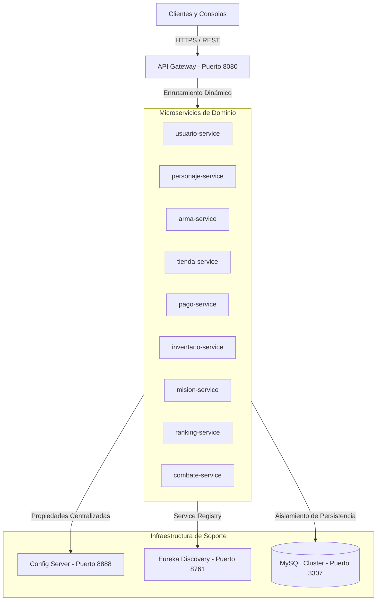

# Plataforma de Microservicios Distribuidos — VideoJuegoOnline

[](https://openjdk.org/)
[](https://spring.io/projects/spring-boot)
[](https://www.docker.com/)
[](#20-licencia)

---

## Documento Guía (Evaluación 3)

### Contexto
* **Dominio del problema:** La necesidad de gestionar de forma transaccional, escalable y tolerante a fallos el ecosistema completo de un videojuego en línea multijugador masivo (MMORPG). Esto implica procesar el ciclo de vida de jugadores, inventarios, combates, misiones, economía interna y clasificaciones en tiempo real.
* **Solución del proyecto:** Una arquitectura distribuida de microservicios desarrollada con Java 21, Spring Boot y Spring Cloud. Cada dominio de negocio (e.g., Combate, Inventario, Usuario) está aislado con su propio esquema de base de datos MySQL (Database-per-Service). Todo el tráfico externo no ingresa directamente a los servicios, sino que es orquestado, filtrado y enrutado de forma centralizada y segura a través de un API Gateway.

### Créditos
* **Integrantes del equipo:** Juan Varas *Elizabeth Reyes * *Scarlett Riquelme *

### Arquitectura
El sistema implementa 12 microservicios en total, divididos en dos capas:
* **Microservicios de Infraestructura (3):**
  * `eureka-server`: Servidor de registro y descubrimiento de instancias.
  * `config-server`: Servidor de configuración centralizada por perfiles.
  * `api-gateway`: Pasarela perimetral (puerto 8080).
* **Microservicios de Dominio de Negocio (9):**
  * `usuario-service`: Gestión de cuentas, perfiles y autenticación.
  * `personaje-service`: Gestión de atributos, niveles y clases de personajes.
  * `arma-service`: Catálogo y características del armamento.
  * `tienda-service`: Comercio in-game (compras y ventas).
  * `pago-service`: Procesamiento transaccional de pagos.
  * `inventario-service`: Almacenamiento seguro de pertenencias del jugador.
  * `mision-service`: Asignación, seguimiento y recompensas de misiones.
  * `combate-service`: Motor de emparejamiento, cálculo de daño y batallas.
  * `ranking-service`: Tablas de clasificación global competitiva.

### Networking
Rutas principales de negocio expuestas por el **API Gateway** (`http://localhost:8080`):
* `/api/usuarios/**` -> Enruta a `usuario-service`
* `/api/personajes/**` -> Enruta a `personaje-service`
* `/api/armas/**` -> Enruta a `arma-service`
* `/api/combates/**` -> Enruta a `combate-service`
* `/api/inventarios/**` -> Enruta a `inventario-service`
* `/api/misiones/**` -> Enruta a `mision-service`
* `/api/pagos/**` -> Enruta a `pago-service`
* `/api/rankings/**` -> Enruta a `ranking-service`
* `/api/productos/**` -> Enruta a `tienda-service`

### Accesos
Toda la documentación interactiva OpenAPI (Swagger) está unificada y disponible vía API Gateway:
* **Swagger UI Centralizado:** [http://localhost:8080/swagger-ui.html](http://localhost:8080/swagger-ui.html)
*(Desde la esquina superior derecha del UI se puede desplegar un selector para consultar la documentación individual de cada uno de los 9 microservicios).*

### Guía de Despliegue

**Opción A: Entorno Contenerizado (Docker - Recomendado)**
1. Verificar instalación de Docker y Docker Compose (v2+).
2. Abrir una terminal en el directorio raíz del proyecto (`VideoJuegoOnline`).
3. Construir las imágenes y levantar toda la orquestación en segundo plano:
   ```bash
   docker compose up -d --build
   ```
4. Monitorear el inicio: primero iniciará MySQL, luego `config-server`, luego `eureka-server` y finalmente el resto de la red.
5. Validar operatividad entrando a [http://localhost:8761](http://localhost:8761) (Eureka) para confirmar que todas las instancias digan `UP`.
6. Para apagar el entorno: `docker compose down`

**Opción B: Entorno Local / Híbrido (IDE)**
1. Levantar MySQL en el puerto `3306` (puede usar su propio XAMPP o correr solo el contenedor `database` del docker-compose).
2. Asegurar credenciales por defecto (usuario: `videojuego`, pass: `secure_user_pass`).
3. Compilar globalmente el proyecto: `mvn clean install -DskipTests`
4. Levantar los microservicios desde el IDE (run de `...Application.java`) en **este orden estricto**:
   - `config-server` (Puerto fijo 8888)
   - `eureka-server` (Puerto fijo 8761)
   - `api-gateway` (Puerto fijo 8080)
   - *Microservicios de negocio* (Se les asignará un puerto dinámico automático al tener `port: 0`).

---

## 1. Clasificación del Software
* **Tipo de Componente:** Plataforma transaccional de misión crítica (Core Backend Platform).
* **Arquitectura:** Arquitectura distribuida basada en microservicios desacoplados (Shared-Nothing Architecture).
* **Público Objetivo:** Arquitectos de Software, Ingenieros de Backend, DevSecOps, SRE y Auditores de Cumplimiento.

---

## 2. Resumen Ejecutivo
**VideoJuegoOnline** es una solución backend de grado empresarial diseñada para soportar el ecosistema operacional de un videojuego en línea multijugador masivo (MMORPG). El sistema provee un motor transaccional escalable, tolerante a fallos y altamente disponible para la administración del ciclo de vida del usuario, persistencia de inventarios, economía interna, emparejamiento, registro de misiones y cómputo de clasificaciones globales en tiempo real. 

La arquitectura implementa la segregación estricta de dominios de negocio y almacenamiento de datos (*Database-per-Service*), garantizando la resiliencia sistémica y mitigando riesgos de fallo en cascada bajo condiciones de carga extrema.

---

## 3. Alcance Funcional

### Qué hace el sistema:
* **Autenticación e Identidad:** Registro, actualización y control de estados/roles de cuentas de usuario mediante servicios perimetrales autenticados.
* **Ciclo de Vida del Personaje:** Gestión de atributos físicos, progresión de niveles y asignación de equipamiento.
* **Transacciones de Tienda e Inventario:** Operaciones atómicas de compra-venta de ítems y control transaccional del inventario de jugador.
* **Motor de Combate:** Cómputo de estadísticas, resolución de encuentros y distribución de experiencia.
* **Misiones y Recompensas:** Seguimiento dinámico de objetivos asignados y progresión de eventos del servidor.
* **Ranking Global:** Cálculo y exposición de tablas de clasificación competitiva en tiempo real.

### Qué NO hace el sistema:
* **Renderizado Gráfico:** No procesa assets visuales, modelos 3D ni mecánicas de presentación visual (responsabilidad de clientes dedicados).
* **Conexiones WebSocket Crudas Directas:** Las transmisiones de baja latencia no se gestionan sin autenticación previa y enrutamiento en la pasarela perimetral (API Gateway).
* **Procesamiento de Pagos Externos Directos:** Delega el flujo financiero a pasarelas certificadas (PCI-DSS) a través de tokens de transacción seguros.

---

## 4. Arquitectura de Alto Nivel
El sistema está estructurado bajo un patrón de microservicios distribuidos empleando **Spring Cloud** para control de infraestructura y **Docker/Docker Compose** para contenedorización y orquestación local:



### Directrices Arquitectónicas Clave:
1. **Configuración Externa (Externalized Configuration):** Los microservicios obtienen su configuración dinámicamente desde el `Config Server` según el perfil activo (`dev`, `docker`).
2. **Descubrimiento Dinámico:** Eureka Server rastrea la topología de la red de contenedores, permitiendo el escalado horizontal elástico de instancias sin intervención manual en el Gateway.
3. **Persistencia Aislada:** Cada microservicio cuenta con un esquema de base de datos MySQL específico. La integridad referencial entre dominios se mantiene a nivel lógico-aplicativo, nunca mediante llaves foráneas inter-base de datos.

---

## 5. Requisitos Previos

El entorno de ejecución y desarrollo requiere:
* **Java SE Development Kit (JDK):** Versión 21 LTS (Distribución Eclipse Temurin recomendada).
* **Apache Maven:** Versión 3.9.x o superior.
* **Docker Engine:** Versión 24.0.0 o superior.
* **Docker Compose:** Versión v2.20.0 o superior (compatible con especificación de archivos de composición 3.8+).
* **Git:** Versión 2.40.0 o superior para control de versiones del monorrepo.

---

## 6. Estructura del Repositorio

La jerarquía del proyecto sigue un esquema monorrepo estructurado por capas físicas y lógicas:

```text
VideoJuegoOnline/
├── .github/                         # Workflows de integración y despliegue continuo (CI/CD)
├── api-gateway/                     # Puerta de enlace perimetral (Spring Cloud Gateway)
│   ├── src/                         # Código fuente del Gateway
│   ├── Dockerfile                   # Build de producción optimizado para Gateway
│   └── pom.xml                      # POM de Maven
├── config-server/                   # Servidor de configuración centralizada
│   ├── config-microservicios/       # Archivos de propiedades YAML por entorno
│   ├── Dockerfile
│   └── pom.xml
├── eureka-server/                   # Servidor de registro y descubrimiento
│   ├── Dockerfile
│   └── pom.xml
├── [microservicio]-service/         # Servicios de negocio (e.g., usuario-service, combate-service)
│   ├── src/                         # Código fuente del servicio
│   ├── Dockerfile                   # Compilación multi-stage y hardening
│   └── pom.xml                      # Descriptor de dependencias Maven
├── init-db/                         # Scripts de aprovisionamiento de base de datos
│   └── init.sql                     # Creación de esquemas y seeding inicial
├── docker-compose.yml               # Orquestación de contenedores locales
└── README.md                        # Documentación técnica maestra del sistema
```

---

## 7. Convenciones de Versionado

El ciclo de lanzamiento cumple rigurosamente con los siguientes estándares:
* **Versionado de Aplicación:** Se rige por **Semantic Versioning 2.0.0** (`MAJOR.MINOR.PATCH`).
* **Tags de Docker:** Toda imagen generada debe etiquetarse con el formato `{SemVer}-{GitCommitHash}` (ejemplo: `1.0.0-a1b2c3d`). Queda estrictamente prohibido el uso de la etiqueta `latest` en entornos de staging y producción.
* **Política de Actualizaciones:** Parches de seguridad (cambios en el tercer dígito) se despliegan automáticamente al pasar el pipeline de CI/CD. Cambios menores o mayores requieren aprobación en el comité de control de cambios (CAB).

---

## 8. Construcción (Build)

Para garantizar la reproducibilidad del artefacto, la compilación de la plataforma se realiza mediante Maven:

```bash
# Compilar todos los módulos del monorrepo y saltar pruebas unitarias temporalmente
mvn clean package -DskipTests

# Ejecutar la suite completa de pruebas unitarias y de integración del proyecto
mvn clean verify
```

Para generar las imágenes Docker de manera local utilizando el motor de compilación nativo:

```bash
# Compilar la imagen de un microservicio específico
docker build \
  --build-arg JAR_FILE=target/usuario-service-0.0.1-SNAPSHOT.jar \
  -t cl.videojuego/usuario-service:1.0.0-dev \
  ./usuario-service
```

---

## 9. Ejecución Local

### 9.1. Ejecución Mediante JAR Nativo
Recomendado para depuración rápida de código fuente en local:

```bash
# Exportar las propiedades necesarias
export SPRING_PROFILES_ACTIVE=dev
export CONFIG_SERVER_URL=http://localhost:8888

# Ejecutar el servicio
java -jar usuario-service/target/usuario-service-0.0.1-SNAPSHOT.jar
```

### 9.2. Ejecución Completa Mediante Docker Compose
Este es el mecanismo preferido para levantar toda la topología del sistema de forma idéntica a producción:

```bash
# Construir imágenes y levantar servicios en segundo plano
docker compose up -d --build

# Monitorear estado operacional de la red de contenedores
docker compose ps

# Detener los servicios y remover redes creadas
docker compose down
```

---

## 10. Configuración y Entorno

El comportamiento del runtime se configura exclusivamente mediante variables de entorno. Los archivos `application.yml` internos no deben almacenar contraseñas ni llaves simétricas.

| Variable de Entorno | Valor por Defecto | Descripción | Perfil Requerido |
| :--- | :--- | :--- | :--- |
| `SPRING_PROFILES_ACTIVE` | `dev` | Define la configuración activa (`dev`, `docker`, `prod`). | Todos |
| `CONFIG_SERVER_URL` | `http://localhost:8888` | URL de acceso al servidor de configuraciones. | Todos |
| `MYSQL_HOST` | `localhost` | Nombre de host o IP de la base de datos relacional. | `dev`, `docker` |
| `MYSQL_PORT` | `3306` | Puerto de escucha de la base de datos MySQL. | Todos |
| `MYSQL_USER` | `videojuego` | Usuario con permisos DDL y DML sobre el esquema. | Todos |
| `MYSQL_PASSWORD` | *(Obligatorio)* | Contraseña cifrada del usuario de la base de datos. | Todos |
| `JVM_OPTS` | `-XX:MaxRAMPercentage=75.0` | Parámetros de ajuste de memoria de la JVM en contenedores. | `prod` |

---

## 11. Dockerfile Recomendado (Producción)

Este Dockerfile implementa una arquitectura **Multi-stage** para aislar el entorno de compilación, inyectar un usuario sin privilegios y asegurar la inmutabilidad del contenedor en tiempo de ejecución:

```dockerfile
# ==========================================
# Fase 1: Compilación (Build Stage)
# ==========================================
FROM eclipse-temurin:21-jdk-alpine AS builder
WORKDIR /build

# Copiar descriptores de dependencias para caching de capas
COPY pom.xml .
COPY .mvn .mvn
COPY mvnw .
COPY usuario-service/pom.xml usuario-service/
COPY usuario-service/src usuario-service/src

# Compilar proyecto optimizando caché de dependencias Maven
RUN chmod +x mvnw
RUN --mount=type=cache,target=/root/.m2 ./mvnw -pl usuario-service clean package -DskipTests -B

# ==========================================
# Fase 2: Tiempo de Ejecución (Runtime Stage)
# ==========================================
FROM eclipse-temurin:21-jre-alpine AS runtime
WORKDIR /app

# Hardening: Creación de usuario no privilegiado (UID/GID 10001)
RUN addgroup -S -g 10001 appgroup && \
    adduser -S -u 10001 -G appgroup -h /app appuser

# Copiar el artefacto final compilado desde la fase anterior
COPY --from=builder /build/usuario-service/target/*.jar app.jar

# Configurar permisos de lectura y ejecución restringidos
RUN chown -R appuser:appgroup /app && \
    chmod 500 /app/app.jar

# Cambiar contexto de ejecución al usuario no privilegiado
USER appuser

# Exposición explícita de puerto
EXPOSE 8080

# Parámetros óptimos de JVM para contenedores
ENTRYPOINT ["java", \
            "-XX:+UseContainerSupport", \
            "-XX:MaxRAMPercentage=75.0", \
            "-XX:+ExitOnOutOfMemoryError", \
            "-Djava.security.egd=file:/dev/./urandom", \
            "-jar", \
            "app.jar"]
```

---

## 12. Docker Compose Recomendado (Orquestación Local)

```yaml
version: '3.8'

networks:
  videojuego-network:
    driver: bridge

volumes:
  mysql-data:
    driver: local

services:
  database:
    image: mysql:8.0.33
    container_name: videojuego-mysql
    ports:
      - "3307:3306"
    environment:
      MYSQL_ROOT_PASSWORD: root_security_pass
      MYSQL_DATABASE: db_usuarios
      MYSQL_USER: videojuego
      MYSQL_PASSWORD: secure_user_pass
    volumes:
      - mysql-data:/var/lib/mysql
      - ./init-db:/docker-entrypoint-initdb.d
    networks:
      - videojuego-network
    healthcheck:
      test: ["CMD", "mysqladmin", "ping", "-h", "localhost", "-u", "videojuego", "-psecure_user_pass"]
      interval: 10s
      timeout: 5s
      retries: 5

  config-server:
    build: ./config-server
    container_name: config-server
    ports:
      - "8888:8888"
    environment:
      - SPRING_PROFILES_ACTIVE=native
    networks:
      - videojuego-network
    healthcheck:
      test: ["CMD", "wget", "--no-verbose", "--tries=1", "--spider", "http://localhost:8888/actuator/health"]
      interval: 15s
      timeout: 5s
      retries: 3

  eureka-server:
    build: ./eureka-server
    container_name: eureka-server
    ports:
      - "8761:8761"
    environment:
      - SPRING_PROFILES_ACTIVE=docker
      - CONFIG_SERVER_URL=http://config-server:8888
    depends_on:
      config-server:
        condition: service_healthy
    networks:
      - videojuego-network
    healthcheck:
      test: ["CMD", "wget", "--no-verbose", "--tries=1", "--spider", "http://localhost:8761/actuator/health"]
      interval: 15s
      timeout: 5s
      retries: 3

  usuario-service:
    build: ./usuario-service
    container_name: usuario-service
    environment:
      - SPRING_PROFILES_ACTIVE=docker
      - CONFIG_SERVER_URL=http://config-server:8888
      - MYSQL_HOST=database
      - MYSQL_PORT=3306
      - MYSQL_USER=videojuego
      - MYSQL_PASSWORD=secure_user_pass
    depends_on:
      database:
        condition: service_healthy
      eureka-server:
        condition: service_healthy
    networks:
      - videojuego-network
```

---

## 13. Salud y Observabilidad

Para soportar las operaciones del centro de operaciones (NOC) y los ingenieros SRE, la plataforma implementa una estrategia de monitoreo de tres pilares:

### 1. Monitoreo de Salud (Health Checks)
Cada servicio expone endpoints estándar de salud:
* **Liveness Probe:** `/actuator/health/liveness` (indica si la JVM requiere reinicio).
* **Readiness Probe:** `/actuator/health/readiness` (indica si el microservicio está listo para recibir tráfico, evaluando conexiones a bases de datos y Eureka).

### 2. Logs Estructurados
Los archivos de configuración de logs (`logback-spring.xml`) inyectan la salida estándar en formato JSON structured logging, lo que facilita el parseo mediante colectores de logs (FluentBit, Logstash):
```json
{"timestamp":"2026-06-23T14:30:15.123Z","level":"INFO","thread":"http-nio-8080-exec-1","logger":"cl.videojuego.usuario_service.service.UsuarioService","message":"Usuario registrado exitosamente","userId":1092,"traceId":"4f8a9e6b7c2d1e0f"}
```

### 3. Métricas
Se exponen métricas en formato Prometheus en `/actuator/prometheus` recopilando:
* Uso de CPU del contenedor.
* Métricas de Garbage Collection (GC) y consumo de Heap Memory.
* Tamaño y uso del pool de conexiones HikariCP.

---

## 14. Catálogo de Interfaces y Endpoints

A través de la pasarela de API Gateway (`:8080`), se expone el siguiente catálogo de endpoints:

| Método | Ruta Relativa | Propósito | Autenticación | Estado Esperado |
| :--- | :--- | :--- | :--- | :--- |
| `GET` | `/api/usuarios` | Listar todos los usuarios del sistema | Requerida (Admin) | `200 OK` |
| `GET` | `/api/usuarios/{id}` | Buscar un usuario mediante su identificador único | Requerida (Usuario) | `200 OK` / `404 Not Found` |
| `POST` | `/api/usuarios` | Registro de un nuevo usuario en la plataforma | Pública | `201 Created` / `400 Bad Request` |
| `PUT` | `/api/usuarios/{id}` | Actualización de perfil del usuario | Requerida (Usuario) | `200 OK` / `400 Bad Request` |
| `DELETE` | `/api/usuarios/{id}` | Eliminación (lógica o física) del registro del usuario | Requerida (Admin) | `200 OK` / `404 Not Found` |

---

## 15. Seguridad y Hardening de la Plataforma

Este microservicio se adhiere a las prácticas recomendadas de los estándares **OWASP Top 10** y las guías de ciberseguridad corporativa:

1. **Aislamiento del Entorno de Compilación:** Uso de imágenes Multi-Stage para descartar compiladores (compiladores de Java, depuradores) de la imagen final que corre en producción.
2. **Ejecución No-Root:** Configuración explícita de UID y GID en 10001. Esto evita que el contenedor obtenga privilegios del Kernel en caso de una vulnerabilidad de escape de contenedor (*container breakout*).
3. **Control Estricto de Secretos:** Queda terminantemente prohibido almacenar contraseñas, llaves SSH o API tokens en archivos `application.yml` o en el repositorio Git. Todos los secretos se inyectan a través de variables de entorno seguras manejadas por HashiCorp Vault en producción.
4. **Análisis de Vulnerabilidades (Static Analysis):** Cada imagen debe pasar un escaneo estático contra la base de datos de CVEs de Trivy antes de ser promovida en el registro:
   ```bash
   trivy image --exit-code 1 --severity HIGH,CRITICAL cl.videojuego/usuario-service:1.0.0
   ```
5. **Entrada de Datos Sanitizada:** Uso sistemático de anotaciones Jakarta Validation (`@NotBlank`, `@Email`, `@Size`) para prevenir inyecciones SQL, Cross-Site Scripting (XSS) y overflows de entrada de payloads.

---

## 16. Operación y Despliegue (Pipeline Promoción)

El ciclo de despliegue sigue una estrategia estructurada de GitOps para garantizar la consistencia entre entornos físicos:

```text
[Rama dev]  ────────> Compilación local y pruebas unitarias rápidas.
     │ (Merge Request)
     ▼
+[Rama staging] ──────> CI/CD automatizado, tests de integración y escaneo Trivy. Despliegue en K8s Staging.
     │ (Aprobación del CAB / Manual Trigger)
     ▼
+[Rama main]  ────────> Empaquetado inmutable del artefacto, firma digital de imagen y despliegue en K8s Prod.
```

### Directrices de Despliegue:
* **Entornos de Staging y Producción:** El despliegue se gestiona exclusivamente a través de plantillas Helm y manifiestos declarativos en Kubernetes.
* **Políticas de Despliegue:** Se aplican estrategias de despliegue progresivo (Rolling Updates) con un máximo de 25% de instancias fuera de servicio simultáneas durante la actualización de versiones.

---

## 17. Edición y Resolución de Problemas (Troubleshooting)

### 1. Error: `HikariPool-1 - Connection is not available, request timed out`
* **Causa:** La base de datos asociada ha excedido su límite de conexiones simultáneas, o bien hay consultas bloqueantes lentas manteniendo conexiones activas.
* **Resolución:** Aumente el pool de conexiones en la variable `SPRING_DATASOURCE_HIKARI_MAXIMUM_POOL_SIZE` (default es 10) o revise el estado de las transacciones mediante un comando SQL administrativo (`SHOW PROCESSLIST;`).

### 2. Error: `Eureka Server communication failure`
* **Causa:** El contenedor del microservicio no puede resolver la dirección de red del Eureka Discovery Server debido a una configuración errónea en `eureka.client.serviceUrl.defaultZone`.
* **Resolución:** Verifique que el microservicio esté en la misma red Docker que Eureka (`videojuego-network`) y que el hostname resuelva correctamente mediante pruebas de conectividad básica (`ping eureka-server`).

### 3. Error: `OutOfMemoryError: Java heap space` en contenedor Docker
* **Causa:** La JVM no detecta los límites impuestos por el contenedor Docker y consume memoria del host superior a la permitida, provocando que el kernel del sistema operativo mate el proceso (OOM Killer).
* **Resolución:** Asegúrese de que el ENTRYPOINT del Dockerfile mantenga la directiva `-XX:+UseContainerSupport` y configure `-XX:MaxRAMPercentage` en un valor no mayor a `75.0`.

---

## 18. Matriz de Compatibilidad

| Componente / Tecnología | Versión Soportada | Estado de Soporte |
| :--- | :--- | :--- |
| **Java Platform** | OpenJDK 21 LTS | Certificado (Producción) |
| **Spring Boot Framework** | 3.2.x | Certificado (Producción) |
| **Spring Cloud** | 2023.0.x (Leyton) | Certificado (Producción) |
| **Docker Engine** | 24.0.0+ | Compatible |
| **Kubernetes Engine (EKS/GKE)** | 1.27+ | Certificado (Producción) |
| **MySQL Database** | 8.0.x | Certificado (Producción) |

---

## 19. Gobernanza del Software y Soporte
* **Responsable Técnico:** Departamento de Arquitectura de Plataforma e Infraestructura.
* **Contacto de Soporte Técnico:** `arquitectura-ti@videojuego-online.internal` (canal exclusivo para ingenieros autorizados).
* **Trazabilidad:** Cada cambio o modificación del sistema es registrado con firmas criptográficas asociadas a los commits de los ingenieros en el repositorio institucional.

---

## 20. Licencia

### LICENCIA DE USO COMERCIAL RESTRINGIDA Y PROPIETARIA

**AVISO LEGAL DE CONFIDENCIALIDAD Y RESTRICCIÓN DE USO**

Este software, incluyendo todo su código fuente, documentación técnica, bibliotecas asociadas y esquemas de base de datos, es propiedad intelectual exclusiva de la entidad titular de los derechos de autor ("El Propietario"). Este software es propietario y confidencial.

Queda estrictamente prohibida cualquier acción que involucre:
1. La reproducción, copia, distribución, comunicación pública o puesta a disposición de terceros de este software, ya sea de forma total o parcial, en cualquier medio físico o digital, sin la autorización previa, expresa y por escrito de los representantes legales autorizados de El Propietario.
2. La modificación, adaptación, traducción, descompilación, ingeniería inversa o creación de obras derivadas basadas en este código, excepto en la medida en que la legislación aplicable lo permita imperativamente.
3. El sublicenciamiento o comercialización del software sin un contrato mercantil vigente firmado con El Propietario.

El acceso no autorizado o el uso fuera de los términos de la licencia específica no transfiere bajo ningún concepto la titularidad de los derechos de propiedad intelectual del software, los cuales permanecen enteramente reservados a El Propietario. El incumplimiento de estos términos facultará a El Propietario a ejercer las acciones legales civiles y penales correspondientes de acuerdo con la legislación de protección de derechos de autor y propiedad intelectual aplicable.

*(C) 2026. Todos los derechos reservados.*
